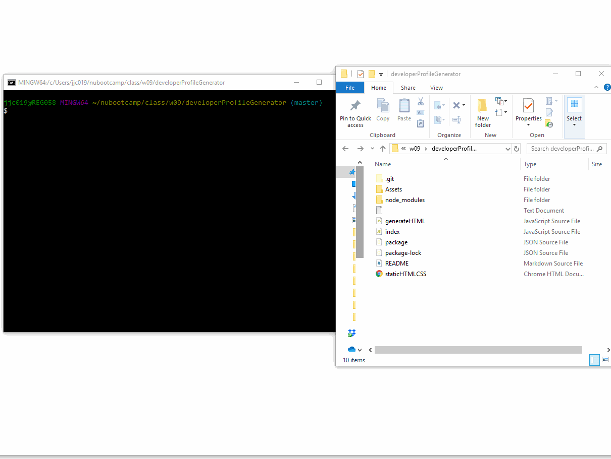

# Homework 9 - Developer Profile Generator

The aim of this assignment is to create a command-line application that dynamically generates an up to date PDF profile from a GitHub username. The application runs with the node index.js command. 

## User Story

AS A product manager

I WANT a developer profile generator

SO THAT I can easily prepare reports for stakeholders

## Composition of Application

After executing the node command, the user is prompted for a Github username, and a choice of background color. GitHub API calls then produce the following data that generates to HTML, then to PDF.

* Profile image
* User name
* Links to the following:
  * User location via Google Maps
  * User GitHub profile
  * User blog
* User bio
* Number of public repositories
* Number of followers
* Number of GitHub stars
* Number of users following

## Process

My approach was to first create the template HTML layout with static data. Then I added the HTML/CSS code and placeholder parameters to the generateHTML file, so that the data obtained from user input and GitHub API responses will be passed to create the HTML, then PDF profile. The functions and APIs were written in the main index.js file. console.log was useful for ensuring the written code ran correctly and produced the expected data responses.

Displaying the data for Github Stars required utilizing a separate API call, as well as a for loop to aggregate all stars across all repos of the Github profile. 

The dependencies for the application are listed in the package.JSON file and a gitignore file is used to to skip and prevent upload of the node_modules folder to GitHub.

The HTML to PDF product I used was html-pdf (https://www.npmjs.com/package/html-pdf). It was relatively easy to use, but changed some of the formatting of the profile page after conversion to PDF. 

## Deployment

The completed application is updated and available for download (including a sample of a generated PDF) in Github: 
https://github.com/jenjch/developerProfileGenerator

A sample of a generated HTML is deployed at:
https://jenjch.github.io/developerProfileGenerator/

An animated gif demonstrating the app functionality is availabe here: 

## Acceptance Criteria

I believe I have met all requirements for the application. Feedback on best practices and improvements would be appreciated.  
